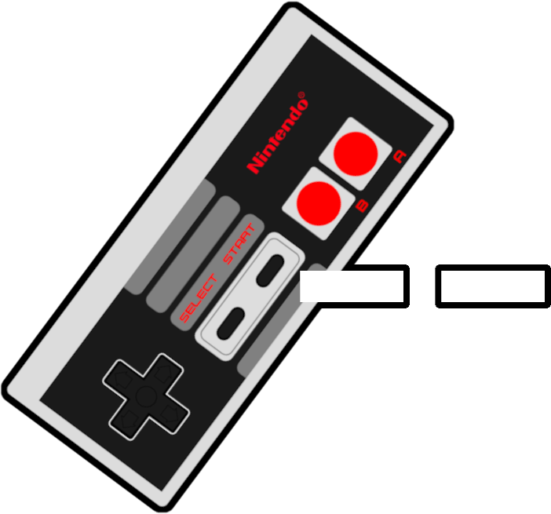

<p align="center">

</p>

<h1 align="center"> sneslite </h1>
sneslite is a simple abstraction of the Nintendo Entertainment System. The backend has been totally recreated, with the front-end missing some features that would make this emulator totally functioning to an end user.

## Dependencies
This project requires the [SFML multimedia library](https://www.sfml-dev.org/). This can be installed on Ubuntu-based systems with `apt install libsfml-dev`.

## Installation
To build from source, run `make all` in the root folder.

## Documentation
Insert link here after compiled and uploaded to external source

### Building documentation from source
Compiling documentation requires [Doxygen](https://doxygen.nl/download.html).

Doxygen can be compiled from the project root directory like so:

```
cd ./docs
doxygen ./doxygen.conf
```

The resulting documentation is output to ./html/
